<div align="center">

# 🎭 Truth or Dare Async Network
*(Rede Social Assíncrona de Verdade e Desafio)*



---
</div>

Uma plataforma social baseada no clássico jogo **"Verdade ou Desafio"**, desenvolvida para dispositivos móveis utilizando **React Native**. A proposta é permitir que usuários criem e participem de desafios de forma assíncrona, ou seja, sem a necessidade de todos estarem conectados ao mesmo tempo.

> [!IMPORTANT]
> **Estado do Projeto: Fase Inicial e Referência de Protótipo**
> Este repositório está em fase ativa de desenvolvimento inicial. A aplicação móvel está sendo construída com base nos **protótipos estáticos em HTML/CSS** contidos na pasta `/prototype`. As imagens a seguir representam o layout-alvo e servem como nossa especificação visual inicial do app.

---

## 🔗 Atalhos Rápidos

Para navegar pelos guias de execução e apresentações do projeto, clique nos links abaixo:

* [**💻 Documentação do Backend (API)**](./backend/README.md) — Guia de configuração da API Node.js/Express, banco de dados PostgreSQL com Prisma ORM, migrations e rotas.
* [**📱 Documentação do Mobile (App)**](./mobile/README.md) — Guia de instalação do Expo, execução do app com Expo Go ou emuladores, hooks, câmera e mídias.
* [**🎨 Apresentação do Protótipo**](./prototype/README.md) — Apresentação visual dos fluxos e telas do aplicativo nos modos claro e escuro.

---

## 📌 Índice Geral

1. [🛠️ Arquitetura do Repositório](#-arquitetura-do-repositório)
2. [⚡ Tecnologias Utilizadas](#-tecnologias-utilizadas)
3. [🚀 Como Executar o Projeto Completo](#-como-executar-o-projeto-completo)
   - [Passo 1: Rodar o Backend](#passo-1-rodar-o-backend)
   - [Passo 2: Rodar o Mobile](#passo-2-rodar-o-mobile)
4. [📁 Estrutura do Repositório](#-estrutura-do-repositório)
5. [📄 Licença](#-licença)

---


## 🛠️ Arquitetura do Repositório

O projeto é organizado como um monorrepósito simples, dividido nas seguintes pastas principais:

* **`/backend`**: Servidor de API REST construído com Node.js e Express, utilizando Prisma ORM para mapear o banco relacional PostgreSQL (com suporte ao Supabase Storage para mídias).
* **`/mobile`**: Aplicação mobile-first desenvolvida em React Native com Expo, utilizando navegação baseada em arquivos (Expo Router) e NativeWind (TailwindCSS) para estilização.
* **`/prototype`**: Contém os protótipos de tela estáticos em HTML/CSS estruturados para ambos os modos (claro e escuro), servindo de especificação visual primária.
* **`/docs`**: Documentações gerais de arquitetura, especificações de requisitos, fluxos de dados do aplicativo e logs do projeto.

---

## ⚡ Tecnologias Utilizadas

### Backend
* **Node.js** (Ambiente de execução)
* **TypeScript** (Tipagem estática e segurança)
* **Express.js** (Roteamento de API e middlewares)
* **Prisma ORM** (Modelagem de dados e migrations)
* **PostgreSQL** (Banco de dados relacional local ou Supabase)
* **Jest + Supertest** (Testes automatizados de integração)

### Mobile
* **React Native + Expo SDK 54** (Desenvolvimento multiplataforma)
* **Expo Router** (Roteamento baseado em arquivos)
* **TypeScript** (Verificação e segurança de tipos)
* **Zustand** (Gerenciamento de estados globais)
* **React Query (TanStack)** (Sincronização de dados e requisições HTTP)
* **TailwindCSS (NativeWind)** (Estilização utilitária e responsiva)
* **Expo Camera & AV** (Captura de vídeo e reprodução de áudio/vídeo)

---

## 🚀 Como Executar o Projeto Completo

Para rodar a aplicação completa localmente na sua máquina, primeiro clone o repositório completo e depois siga o fluxo de inicialização de cada componente:

### Passo 1: Clonar o repositório
```bash
# Clone o projeto completo (monorrepósito)
git clone https://github.com/pedrolabre/truth-or-dare-async-network.git
cd truth-or-dare-async-network
```

### Passo 2: Rodar o Backend
Abra um terminal na pasta raiz do projeto clonado, navegue até a pasta do backend, instale as dependências e configure o banco de dados local ou na nuvem:

```bash
# 1. Entrar na pasta do backend
cd backend

# 2. Instalar dependências
npm install

# 3. Configurar variáveis de ambiente
# Crie um arquivo .env na raiz do backend seguindo o modelo do .env.example

# 4. Rodar as migrations do Prisma
npx prisma migrate dev

# 5. Iniciar o servidor de desenvolvimento
npm run dev
```
O servidor backend estará rodando por padrão em `http://localhost:3333`.

### Etapa 2: Rodar o Aplicativo Mobile
Abra outro terminal na pasta raiz do projeto clonado, navegue até a pasta do aplicativo mobile, configure o IP do backend local e inicie o Expo:

```bash
# 1. Entrar na pasta do mobile
cd mobile

# 2. Instalar dependências
npm install

# 3. Atualizar o IP local no arquivo .env.local de forma automática:
# No Windows:
python scripts/update_mobile_env_ip.py

# No macOS/Linux:
python3 scripts/update_mobile_env_ip.py

# 4. Iniciar o servidor de desenvolvimento do Expo
npx expo start
```
Use o aplicativo **Expo Go** no seu celular para escanear o QR code exibido no terminal e abrir o app.

---

## 📁 Estrutura do Repositório

Aqui está o mapa estrutural detalhado do monorrepósito:

```text
truth-or-dare-async-network/
├── backend/                       # Servidor e API (Node.js + Express)
│   ├── prisma/                    # Esquemas e migrations do banco de dados (Prisma)
│   ├── src/                       # Código-fonte da aplicação
│   │   ├── controllers/           # Controladores de requisição HTTP
│   │   ├── services/              # Lógica de negócios e comunicação com banco
│   │   ├── routes/                # Definição dos endpoints da API
│   │   └── middlewares/           # Middlewares de segurança e validação
│   ├── tests/                     # Testes de integração (Jest + Supertest)
│   ├── scripts/                   # Scripts utilitários de banco e população
│   ├── performance/               # Configurações de teste de carga (Artillery)
│   └── package.json               # Dependências do backend
├── mobile/                        # Aplicativo mobile (React Native + Expo)
│   ├── app/                       # Telas e roteamento baseado em arquivos (Expo Router)
│   ├── components/                # Componentes reutilizáveis organizados por feature
│   ├── services/                  # Comunicação com a API e armazenamento local
│   ├── hooks/                     # Custom hooks para estados visuais do app
│   ├── assets/                    # Imagens, fontes e ícones locais do app
│   ├── scripts/                   # Scripts utilitários de ambiente e IPs
│   └── package.json               # Dependências do aplicativo mobile
├── prototype/                     # Apresentação do protótipo de interface
│   ├── light-mode/                # Layouts visuais no modo claro
│   ├── dark-mode/                 # Layouts visuais no modo escuro
│   └── README.md                  # Apresentação detalhada das telas do protótipo
├── docs/                          # Documentação geral e de visão do produto
│   ├── backend/                   # Documentações relativas ao backend
│   │   └── tests/                 # Planos e especificações de testes do backend
│   └── mobile/                    # Documentações relativas ao mobile
│       └── tests/                 # Planos e especificações de testes do mobile
└── README.md                      # Documentação geral do repositório (este arquivo)
```

---

## 📄 Licença

Este projeto é propriedade privada.

